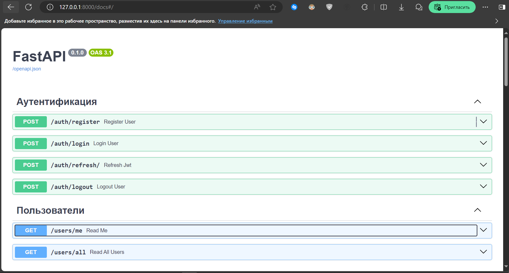
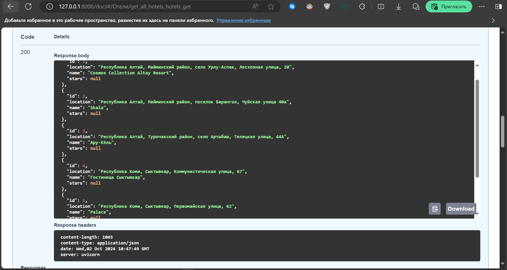
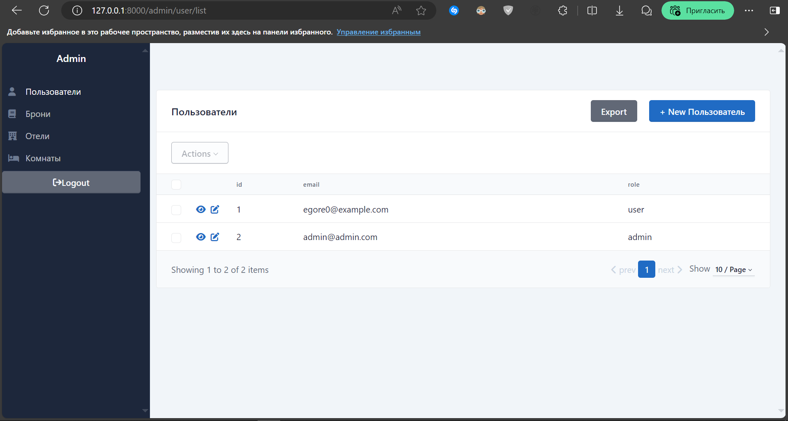
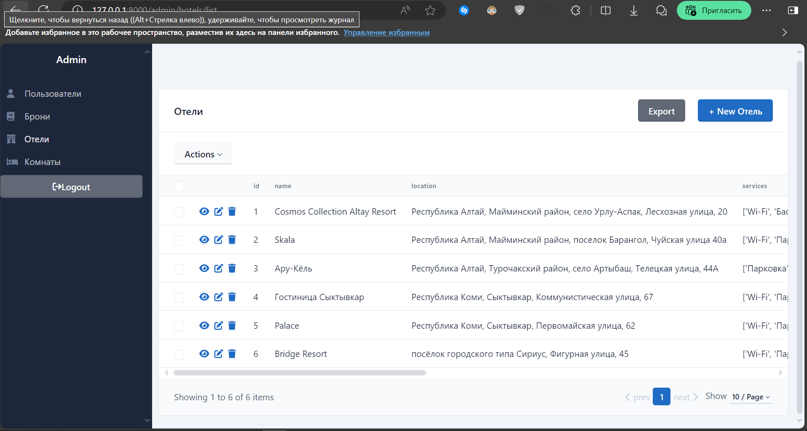
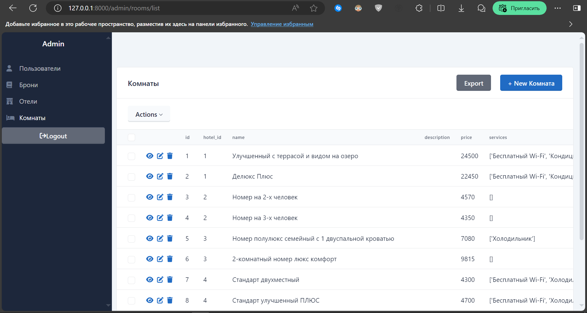

<h1 align="center" style="color: #4CAF50; font-family: 'Segoe Script'">Navigator</h1>

### Описание
*Navigator* - сервис-аналог Booking.com для бронирования отелей, 
разработанный мной при прохождении курса по FastAPI. С его помощью
пользователи могут совершать такие действия как, например,
* регистрация в системе
* получение информации об отелях
* бронирование номеров
* отмена уже имеющихся у них броней.



---
В рамках данного проекта я занимался разработкой backend-
части сервиса, проектированием API, а также контейнеризацией.

### Стек
* Backend реализован с помощью фреймворка **FastAPI**
* Для управления данными используется СУБД **PostgreSQL**
* Взаимодействие с базой данных осуществляется через асинхронную
версию ORM **SQLAlchemy**
* Админка SQLAdmin
* Авторизация по **JWT** 
* Кэширование запросов через **Redis**
* Объединение контейнера с приложением с другими сервисами через 
**Docker compose**
---

### Установка и запуск

Для запуска вам потребуется наличие `Docker` на компьютере

1. Склонируйте репозиторий
    ```shell
    git clone git@github.com:Egore000/Navigator.git
    cd Navigator
    ```
   
2. Создайте .env файлы

    При запуске через `Docker compose` файл `.env.dev` заменяется на
`.env.prod`

    Создайте файлы `.env.dev` и `.env.prod` по аналогии с 
`.env_example.dev` и `.env_example.prod`


3. Создайте публичный и приватный ключи:

    Для работы с аутентификацией по JWT-токенам необходимы публичный
и приватный ключи. Чтобы их сгенерировать, необходимо скачать утилиту
<a href="https://openssl-library.org/source/index.html">OpenSSL</a>.

    Затем выполните следующие команды:
   
   * Создайте папку для хранения ключей
        ```shell
        mkdir ./certs
        cd ./certs
        ```
   * Сгенерируйте приватный ключ
        ```shell
        openssl genrsa -out private.pem 2048
        ```
   * Сгенерируйте публичный ключ
        ```shell
        openssl rsa -in private.pem -outform PEM -pubout -out public.pem
        ```

4. Настройте Celery
    
   Для этого необходимо включить двухэтапную аутентификацию
и создать пароль для приложения в настройках Google-аккаунта 
для отправки электронных писем через `Celery`. Добавить пароль 
в .env файлы (SMTP).


5. Запуск

    ```shell
   docker compose up
   ```

6. Доступ:

    API: http://YOUR_IP/docs
    
    Admin: http://YOUR_IP/admin
   
    Flower: http://YOUR_IP/flower/

    Grafana: http://YOUR_IP/grafana/

    Prometheus: http://YOUR_IP/prometheus/

### Заполнение базы данных

Для заполнения можно использовать данные (запросы) из
директории `test_data/`

### Примеры работы



#### Админ-панель

* Пользователи


* Отели


* Комнаты


### TO-DO

На данный момент сервер развёрнут лишь локально. В дальнейшем
планируется разработка frontend части, развёртывание в облаке,
настройка CI/CD пайплайнов. 


